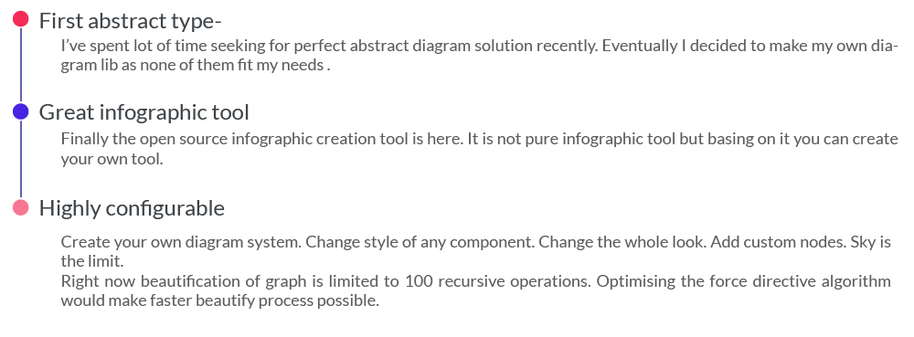
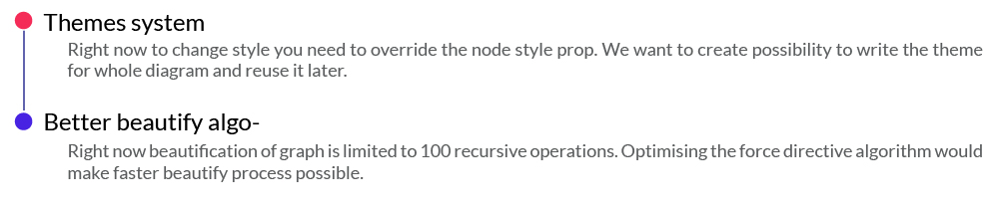

Diagram is the tool for making node based systems. Define your own behaviour of this react based diagram system and create your tool. Visual programming is trending right now so this is a good basis.

[Project Page](https://diagram.graphqleditor.com)



## Live demo

Here is [Live Demo](https://demo.graphqleditor.com) of diagram used to create node based graphql system


## Add to your project

```sh
$ npm install @slothking-online/diagram
```

## Develop & Contribute

```sh
$ git clone https://github.com/slothking-online/diagram
$ npm install
$ npm run start
```

## Define spacebar menu actions

```tsx
import { Graph } from '@slothking-online/diagram';
import * as React from 'react';
let allCategories = [
  {
    name: 'middlewares',
    items: [
      {
        name: 'middleware',
        type: 'middleware',
        inputs: [
          {
            name: ''
          }
        ],
        outputs: [
          {
            name: ''
          }
        ]
      }
    ]
  }
];

export const MyGraphComponent = () => <Graph categories={allCategories} />;
```

Now if you press spacebar when mouse is on the graph you get this menu, which creates nodes.

## Serialization of data

```jsx
<Graph
  categories={allCategories}
  serialize={(nodes, links) => {
    //here you receive nodes and links after every graph change
  }}
  validate={(node1, node2) => {
    // not necessary but you can add custom validation function between every node
  }}
/>
```

### Controls

* Create - press and hold Spacebar and choose category -> node and Left Mouse Button click
* Pan - press and hold Left Mouse Button and move mouse
* Move - press and hold Left Mouse Button on node
* Rename - To rename node simply start typing when one node is selected
* Connect - Click and hold desired node output and move it to other node's output then release mouse button
  IMPORTANT: Every node is connectable only if it creates valid schema. Experiment to test
* Node Properties - Click right mouse button on node
* CMD/CTRL + Left Mouse Button Click - select multiple nodes
* Delete - Click delete button when node/nodes are selected or right click -> delete

## Keyboard shortcuts

* CMD/CTRL + Mouse Click - Select multiple nodes
* CMD/CTRL + L - Beautify diagram
* CMD/CTRL + Z - Undo
* CMD/CTRL + Y - Redo
* CMD/CTRL + D - Duplicate Nodes
* CMD/CTRL + F - Find nodes
* ALT/OPTION + V - Find duplicate definitions(Validate)
* ALT/OPTION + LMB on cloned node - navigate to definition
* RIGHT MOUSE CLICK on node - node actions

## Contribute

Feel free to contact us and contribute in graphql editor project. aexol@aexol.com

1.  fork this repo
2.  Create your feature branch: git checkout -b feature-name
3.  Commit your changes: git commit -am 'Add some feature'
4.  Push to the branch: git push origin my-new-feature
5.  Submit a pull request


